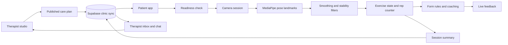

# PhysioLoop

> Rehab that watches your form.

PhysioLoop is a browser-based rehabilitation companion that connects therapist-authored exercise plans with camera-guided home sessions. Patients receive rep-by-rep feedback while they exercise, and therapists can review completed sessions, publish updated plans, record custom movements, and chat with patients.

**Live application:** [hackbattle-26.vercel.app](https://hackbattle-26.vercel.app/)

## Why PhysioLoop?

Home rehabilitation often happens without immediate feedback. Patients may lose consistency, perform movements incorrectly, or wait until their next appointment to report problems. PhysioLoop closes that gap with a continuous care loop:

1. A therapist creates and publishes a rehabilitation plan.
2. The patient opens the plan using a clinic access code.
3. On-device pose tracking counts repetitions and identifies common form issues.
4. The session summary, readiness score, and movement results are sent back to the therapist.
5. The therapist reviews the result, messages the patient, and adjusts the next plan.

PhysioLoop is designed to extend a therapist's guidance beyond the clinic, not replace professional care.

## Features

### Patient experience

- Join a therapist's plan using a clinic access code.
- Complete a readiness check before starting a session.
- Follow ordered exercise plans with per-exercise repetition targets.
- View a live camera feed, pose skeleton, rep counter, and movement state.
- Receive focused visual and spoken coaching cues one correction at a time.
- Save partial sessions and review good, flagged, and completed repetitions.
- Track streaks, weekly activity, total repetitions, and session history.
- Message the therapist from the patient dashboard.
- Continue using the last locally cached plan when cloud access is unavailable.

### Therapist experience

- Build, reorder, and publish patient exercise plans.
- Assign repetition targets and reusable clinic access codes.
- Review patient sessions and readiness information in a clinic inbox.
- Exchange realtime messages with individual patients.
- Record a custom exercise with the camera and reuse it in future plans.
- Access a shared library of therapist-recorded movement references.
- Preview the published plan from the patient's perspective.

### Supported exercises

- Bodyweight squat
- Lateral raise
- Bicep curl
- Standing shoulder raise
- Standing knee raise
- Custom therapist-recorded movement

## How It Works



Camera frames are processed in the browser. The movement pipeline converts pose landmarks into joint and body metrics, rejects unstable frames, detects exercise states, counts completed movement cycles, ranks form issues, and presents one useful correction to the patient.

## Tech Stack

- **Frontend:** React 19, TypeScript, Vite
- **Pose estimation:** MediaPipe Tasks Vision Pose Landmarker
- **Cloud synchronization:** Supabase Postgres and Realtime
- **Local persistence:** Browser `localStorage`
- **Testing:** Vitest
- **Deployment:** Vercel

## Getting Started

### Prerequisites

- Node.js 20.19 or newer
- pnpm 10 or newer
- A webcam for live exercise sessions
- A Supabase project for cross-device synchronization and chat (optional)

### Install and run

```bash
git clone https://github.com/prnvh/hackbattle-26.git
cd hackbattle-26
corepack enable
pnpm install
pnpm dev
```

Open the local URL printed by Vite. On the first development run or build, the setup script copies the MediaPipe WebAssembly files and downloads the pose-landmarker model if it is not already available.

The app works without Supabase in local-only mode. Plans, profiles, custom references, and session history will remain in the current browser.

## Supabase Setup

1. Create a Supabase project.
2. Open its SQL editor and run [`supabase/clinic_sync.sql`](supabase/clinic_sync.sql).
3. Create a `.env` file in the repository root:

```env
VITE_SUPABASE_URL=https://your-project.supabase.co
VITE_SUPABASE_ANON_KEY=your-anon-key
```

4. Restart the development server.

With these variables configured, plans, sessions, messages, and custom exercise references synchronize between patient and therapist devices in realtime.

## Demo Flow

For the clearest end-to-end demonstration:

1. Open **Therapist**, enter a therapist name, create a plan, add an access code, and publish it.
2. Open the application in another browser or private window.
3. Choose **Patient**, enter a name and the published access code, and open the plan.
4. Complete the readiness check and start a camera-guided exercise.
5. Finish the session and review its rep and form summary.
6. Return to the therapist inbox to show the synchronized session log.
7. Open the conversation and send a message between the therapist and patient views.

Use HTTPS or `localhost` when demonstrating camera access. Keep a recorded backup demo available in case the venue browser blocks webcam permissions.

## Available Scripts

| Command | Purpose |
| --- | --- |
| `pnpm dev` | Start the Vite development server |
| `pnpm build` | Type-check and create a production build in `dist/` |
| `pnpm preview` | Preview the production build locally |
| `pnpm test` | Run the Vitest test suite |

## Project Structure

```text
src/
  biomechanics/   Joint-angle and body-position measurements
  coaching/       Feedback text, cues, and issue prioritization
  components/     Shared interface and live-session components
  exercises/      Exercise states, counters, form rules, and references
  hooks/          Camera and exercise-session orchestration
  screens/        Patient, therapist, progress, chat, and session views
  state/          Local persistence, cloud sync, roles, and session records
  vision/         Pose detection, rendering, smoothing, and stability
supabase/
  clinic_sync.sql Database tables, policies, indexes, and realtime setup
scripts/
  ensure-mediapipe-assets.mjs
```

## Roadmap

- Personalized calibration and therapist-defined movement thresholds
- Adaptive plans based on readiness, adherence, and recent movement quality
- Authenticated patient and therapist accounts with clinic-scoped permissions
- Therapist alerts for repeated pain reports or declining range of motion
- Downloadable recovery reports and longitudinal range-of-motion comparisons
- Accessibility improvements and multilingual voice coaching
